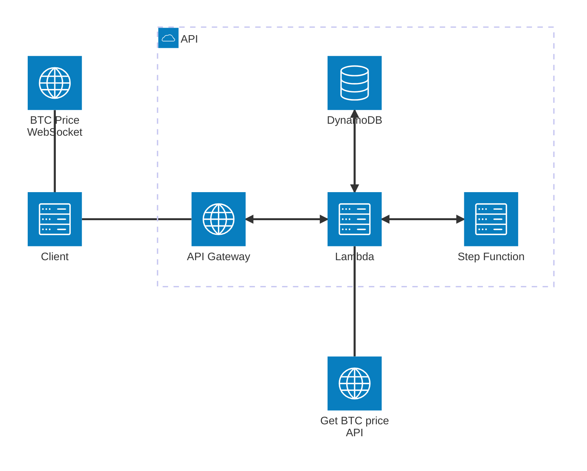
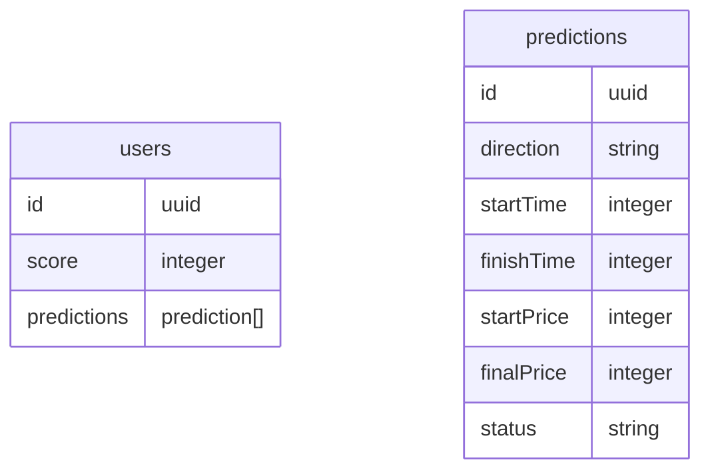

## Predictabit

A web app that allows users to make guesses on whether the market price of Bitcoin (BTC/USD) will be higher or lower after one minute.

### 1. App Setup

- Run `npm install` to install dependencies. (Ensure you have node and npm installed already)
- Run `npm run dev` to start the local server (http://localhost:5173).
- Run `npm test` to run the test suite.

### 2. Architecture

Two API's were created using API Gateway and AWS Lambdas: `usersApi` and `predictionsApi`.

The `usersApi` supports two HTTP endpoints:

- GET /users/:id (Fetch a user by uuid)
- POST /users (Create a new user)

The `predictionsApi` supports two HTTP endpoints:

- POST /predictions/place (place a prediction with user's id, duration of prediction, and direction.)
- POST /predictions/close (close user's last prediction)

Note: The endpoint to close predictions is only meant to be called internally (from either within a VPC on AWS or custom authentication).
The endpoint isn't triggered client side (because the client browser could be closed).

The external API used for fetching Bitcoin prices from OKX. The [GET /ticker](https://www.okx.com/docs-v5/en/#order-book-trading-market-data-get-ticker) is used when predictions are placed or closed. And a [tickers websocket](https://www.okx.com/docs-v5/en/#order-book-trading-market-data-ws-tickers-channel) is used for fetching live prices on the client.

In hindsight, it appears that there is often a significant mismatch between the prices from the websocket and the HTTP endpoint. Which leads to some confusing UX. Given more time, I would have gone with a different architecture to get around that issue.

### 3. Database

The database used is DynamoDB. Only one table was created (a users table). See ERD below:

Note: It looks like two tables here, but that's just because I don't know how to nest the predictions schema inside the users.

### 4. Deployment

The app was deployed using Amplify. While most of the infrastructure is "infrastructure as code", I did have to set up some IAM roles in the AWS console for parts of the application (eg. the Step Function).

There is no CI/CD set up (I would normally have added it through Github Actions).

### 5. Future Improvements

There are many things I would do if I had more time (or if this was going to be deployed to production):

1. Add tests on both front- and backend.
2. Refactor the backend API (would switch to a websocket for predictions to reduce latency).
3. Switch lambda functions to TS from JS.
4. Add error handling.
5. Think about buffering the price stream (numbers change up to ever 100ms which is a little fast on the eyes).
6. Add more interactivity/animations to make the 60 seconds more engaging for users.

### 6. Requirements

Please, build a web app that allows users to make guesses on whether the market price of Bitcoin (BTC/USD) will be higher or lower after one minute.

#### Rules:

- The player can at all times see their current score and the latest available BTC price in USD
- The player can choose to enter a guess of either “up” or “down“
- After a guess is entered the player cannot make new guesses until the existing guess is resolved
- The guess is resolved when the price changes and at least 60 seconds have passed since the guess was made
- If the guess is correct (up = price went higher, down = price went lower), the user gets 1 point added to their score. If the guess is incorrect, the user loses 1 point.
- Players can only make one guess at a time
- New players start with a score of 0
- Players should be able to close their browser and return back to see their score and continue to make more guesses.

#### Solution requirements:

- The guesses should be resolved fairly using BTC price data from any available 3rd party API
- The score of each player should be persisted in a backend data store (AWS services preferred)
- Please provide us a link to your deployed solution
- Testing is encouraged
- Describe the app's functionality as well as how to run and deploy the application to the best of your ability in a README file.
- Please provide the project in a public git repository.
